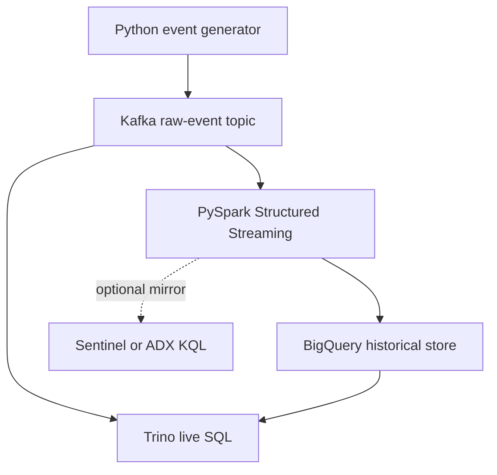

# Insider Threat Streaming Detection Pipeline

A portfolio project demonstrating how security telemetry can be streamed, normalized, scored, stored, and queried with **Kafka, PySpark, BigQuery, SQL, KQL, and Trino**. All events are synthetic; no production or personal data is included.

## Architecture



### What each technology does

| Technology | Responsibility |
|---|---|
| Kafka | Buffers synthetic identity and data-access events in real time |
| PySpark | Parses JSON, normalizes fields, enriches events, and calculates explainable risk |
| BigQuery | Stores partitioned and clustered historical telemetry for large-scale analysis |
| SQL | Implements event-level and aggregate behavioral detections in BigQuery |
| Trino | Queries live Kafka data and historical BigQuery data through one SQL engine |
| KQL | Implements SIEM-style hunting and scheduled detection logic in Sentinel or Azure Data Explorer |

KQL is intentionally shown as an optional security-analytics mirror. It does not query BigQuery directly; normalized events must first be ingested into Sentinel/ADX.

## Detection scenario

The pipeline identifies possible insider-driven exfiltration using explainable signals:

- unusually large upload/download: +35
- access from a high-risk simulated country: +25
- unknown device: +15
- privileged account: +10
- restricted data: +10
- off-hours activity: +5

Scores of 70+ are `HIGH`, 40–69 are `MEDIUM`, and lower scores are `LOW`. These weights are demonstration values, not production threat intelligence.

## Prerequisites

- Python 3.10+
- Docker with Compose
- Java 17 and Spark 3.5 for local `spark-submit`, or Google Cloud Dataproc
- A Google Cloud project and BigQuery dataset for the cloud phase
- Optional: Microsoft Sentinel or Azure Data Explorer for KQL

## 1. Start Kafka and Trino

```bash
cp .env.example .env
make install
make up
make topic
```

## 2. Generate synthetic events

```bash
make produce
```

Inspect the live stream with Trino:

```bash
docker compose exec trino trino --execute \
  'SELECT user_id,event_type,country,bytes_transferred FROM kafka.default."security-events" LIMIT 20'
```

## 3. Create the BigQuery table

Open `sql/bigquery/schema.sql`, replace `PROJECT_ID`, and run it in BigQuery Studio. Keep the dataset and Spark job in the same region.

Create `credentials/gcp-service-account.json` locally and grant only the permissions required to create jobs and append to the target table. Credentials are ignored by Git.

## 4. Run PySpark streaming

Export the values from `.env`, then submit the job with the Kafka and BigQuery connectors that match your Spark version:

```bash
set -a && source .env && set +a
spark-submit \
  --packages org.apache.spark:spark-sql-kafka-0-10_2.12:3.5.5,com.google.cloud.spark:spark-3.5-bigquery:0.42.4 \
  spark/stream_processor.py
```

For a containerized deployment, change `KAFKA_BOOTSTRAP_SERVERS` to `kafka:19092`. For Dataproc, use the preinstalled BigQuery connector and submit the same PySpark job to the cluster.

## 5. Run BigQuery SQL detections

Replace `PROJECT_ID` in `sql/bigquery/detections.sql`, then run each query in BigQuery Studio. The first detects high-risk events; the second detects aggregate exfiltration across multiple smaller events.

## 6. Connect Trino to BigQuery

```bash
cp trino/catalog/bigquery.properties.example trino/catalog/bigquery.properties
# Replace YOUR_GCP_PROJECT_ID, then restart Trino.
docker compose restart trino
docker compose exec trino trino --file /etc/trino/queries.sql
```

You can also paste the statements from `trino/queries.sql` into the Trino CLI.

## 7. Test the KQL detections

Create an `InsiderRiskEvents` table in Microsoft Sentinel or Azure Data Explorer and ingest a sanitized export of the normalized event schema. Paste `kql/detections.kql` into Logs. In Sentinel, retain `TimeGenerated` in the result before turning a query into a scheduled analytics rule.

## 8. Validate

```bash
make test
```

Expected checks:

1. Kafka topic receives both normal and simulated anomalous events.
2. PySpark rejects malformed JSON as null records and scores valid events consistently.
3. BigQuery rows are partitioned by event date and searchable by user/severity.
4. SQL, Trino SQL, and KQL return the seeded anomalous activity.
5. Replaying an `event_id` does not duplicate it inside a single Spark micro-batch.

## Repository map

```text
producer/                 synthetic Kafka producer
spark/                    Structured Streaming normalization and scoring
sql/bigquery/             warehouse schema and detections
kql/                      Sentinel/ADX hunting queries
trino/                    Kafka and BigQuery catalog configuration
tests/                    generator tests
```

## Interview explanation

> I built a synthetic insider-risk telemetry pipeline. Kafka decouples event producers from consumers, and PySpark Structured Streaming parses and enriches the stream with transparent risk signals. I persist normalized history in a partitioned and clustered BigQuery table, then use SQL for behavioral detections. Trino provides federated SQL over live Kafka and historical BigQuery data. I translated the same detection intent into KQL to show how the logic would operate in Sentinel after the normalized schema is mirrored there.

## Security notes

- Never commit cloud keys, tokens, real employee data, or production IP addresses.
- Replace static credentials with workload identity in production.
- Apply least privilege, encryption, retention limits, schema validation, dead-letter handling, and audit logging before production use.
- Tune thresholds against baselines and document false-positive exclusions with Legal, HR, Privacy, and Insider Risk stakeholders.

## References

- [Apache Kafka quickstart](https://kafka.apache.org/quickstart/)
- [Spark Structured Streaming with Kafka](https://spark.apache.org/docs/latest/structured-streaming-kafka-integration.html)
- [BigQuery Spark connector examples](https://cloud.google.com/dataproc/docs/examples/bigquery-example)
- [Trino Kafka connector](https://trino.io/docs/current/connector/kafka.html)
- [Trino BigQuery connector](https://trino.io/docs/current/connector/bigquery.html)
- [KQL overview](https://learn.microsoft.com/kusto/query/)
- [Microsoft Sentinel scheduled analytics rules](https://learn.microsoft.com/azure/sentinel/create-analytics-rules)

## License

MIT

